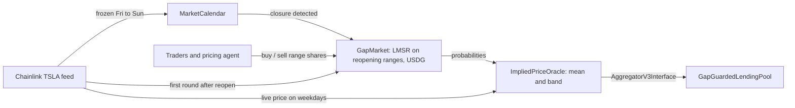

# Gapline

**A market-implied weekend price for tokenized stocks, settled in USDG on Robinhood Chain.**

Tokenized stocks trade onchain 24/7. Their Chainlink feeds do not. From Friday afternoon to Sunday 20:00 ET
the feed holds its last price, and Chainlink's own documentation says it "may hold the last published price"
with "no heartbeats during off-hours". Every lending market, index and vault built on tokenized stocks is
blind for that window, and whoever is on the wrong side of Monday's gap eats it.

Gapline prices that window. For every closure it runs a USDG-collateralized market on where the stock
reopens, turns the market's probabilities into a live price with a confidence band, and exposes it through
the same `AggregatorV3Interface` lending protocols already read.

## The problem, measured

Robinhood's mainnet TSLA feed (`0x4A11...7C38`) over the last three weekends:

| Last print before the weekend | First print after | Frozen for | Reopening gap |
|---|---|---|---|
| $353.98, Fri Sep 4, 18:14 UTC | $354.15, Tue Sep 8, 00:00 UTC (Labor Day) | 77.8 h | +0.05% |
| $365.91, Fri Sep 11, 14:50 UTC | $361.94, Mon Sep 14, 00:00 UTC | 57.2 h | -1.09% |
| $363.80, Fri Sep 18, 19:48 UTC | $365.19, Mon Sep 21, 00:00 UTC | 52.2 h | +0.38% |

The feed is frozen for roughly a third of every week. The first round after every closure lands exactly
at the Sunday 20:00 ET reopen, which is what Gapline settles against.

## How it works



1. **`MarketCalendar`** knows when the 24/5 session is closed: weekends, NYSE holidays and US daylight time.
   A session runs from 20:00 ET on the previous day to 20:00 ET, so shifting Eastern time by four hours maps any
   instant to its trading day.
2. **`GapMarket`** opens during a closure. It snapshots the last pre-close price and splits the reopening
   move into ranges (`-3% or worse`, `-3% to -1%`, ... `+3% or better`). An LMSR market maker, seeded by the
   market's creator with its worst-case loss `b * ln(n)`, always quotes every range, and its prices are
   probabilities. Each winning share redeems for 1 USDG. Every trade pays a 1% fee to the creator, the
   underwriter, so funding a market has positive expected value; fees are kept apart from the collateral that
   backs winning shares.
3. **Settlement is permissionless.** Anyone passes the first feed round published at or after the reopen;
   the contract checks the round before it was published earlier, so a later, friendlier round cannot be
   cherry-picked.
4. **`ImpliedPriceOracle`** is a drop-in `AggregatorV3Interface`. When the feed is live it passes the price
   through. When the feed is frozen (closed session, or no update during market hours, which also covers
   corporate-action pauses) it reports `refPrice * (1 + mean move)` from the deepest market for the current
   closure, and a `mean +/- 2 sd` band.
5. **`GapGuardedLendingPool`** (demo) uses the band asymmetrically: new risk (borrow, withdraw) is valued at
   the band's **low** end, liquidation requires the position to be unhealthy at the **high** end. A thin
   weekend DEX print cannot liquidate anyone, and nobody can over-borrow against an optimistic weekend price.
   If the feed is frozen and no market prices it, both pause.
6. **The pool insures itself.** Each weekend the keeper calls `hedge()`: the pool buys shares of the worst
   range paying 10% of its outstanding loans if TSLA reopens 3% or more down, spending at most 1% of loans in
   premium. The protocol carrying the gap risk is the buyer that pays the underwriter; `collectHedge()` returns
   any payout to reserves. Borrowers can buy the same cover for their own loans from the Borrow page.

## Deployed on Robinhood Chain testnet (46630)

All contracts are verified on the explorer. These are the v2 contracts (underwriter fee, pool auto-hedge),
deployed 2026-09-22; the v1 set is retired.

| Contract | Address |
|---|---|
| GapMarket | [`0x5f2d5F54e28002a9b06100532a1EE9B9ad5e479e`](https://explorer.testnet.chain.robinhood.com/address/0x5f2d5F54e28002a9b06100532a1EE9B9ad5e479e) |
| ImpliedPriceOracle | [`0xeB246817d2440F82F4B4C04c2C120afEFe1E5EC4`](https://explorer.testnet.chain.robinhood.com/address/0xeB246817d2440F82F4B4C04c2C120afEFe1E5EC4) |
| GapGuardedLendingPool | [`0xBB924f325a7cDb1D53E514cB9691E3a19e26F6d1`](https://explorer.testnet.chain.robinhood.com/address/0xBB924f325a7cDb1D53E514cB9691E3a19e26F6d1) |
| MarketCalendar | [`0x4897cA16aF49F84D689b59Be81abD9C0C760280f`](https://explorer.testnet.chain.robinhood.com/address/0x4897cA16aF49F84D689b59Be81abD9C0C760280f) |
| MirroredFeed (RHTSLA / USD) | [`0x284a56BFBa8D03b662A23f4788bD458f835058f5`](https://explorer.testnet.chain.robinhood.com/address/0x284a56BFBa8D03b662A23f4788bD458f835058f5) |
| USDG (Paxos, testnet) | `0x7E955252E15c84f5768B83c41a71F9eba181802F` |
| TSLA stock token (testnet) | `0xC9f9c86933092BbbfFF3CCb4b105A4A94bf3Bd4E` |

Chainlink publishes Robinhood stock feeds on mainnet only. On testnet, `MirroredFeed` is an owner-only copy
of the real mainnet RHTSLA / USD feed: the relayer copies every mainnet round, with its original timestamps,
so the testnet feed freezes and reopens exactly like the real one. On mainnet, point the oracle and markets
at the Chainlink feed directly; nothing else changes.

## Repository

```
contracts/          Foundry: the five contracts, tests, deploy script, deployments/46630.json
packages/abi        typed ABIs and addresses, generated by @wagmi/cli from the Foundry build
apps/relayer        copies mainnet Chainlink rounds to the testnet MirroredFeed
apps/agent          keeper + pricing agent (opens, prices, settles and collects each weekend)
apps/web            TanStack Router + Query, wagmi, shadcn/ui, zustand
ecosystem.config.cjs  pm2 processes for the relayer, agent and web app
docs/DEMO.md        weekend runbook, recording plan, pitch and submission text
docs/knowledge-graph.md   components, addresses, measured facts and decisions (source: knowledge-graph.json)
AGENTS.md / CLAUDE.md     instructions for coding agents working in this repo
```

## Tests

```bash
cd contracts
forge test                                                     # 41 tests, 2 fuzz suites x 1,000 runs
forge test --match-contract ForkedWeekend --fork-url robinhood_testnet   # full weekend on the deployed contracts
```

- `MarketCalendar`: summer and winter closures, Thanksgiving, the DST-change weekend, and a fuzz test that
  every closed instant has a later open that really is the first open instant.
- `GapMarket`: pricing, slippage, round trips losing only fees, all-in quotes, fees to the creator, cherry-pick
  resistance, settlement, and a fuzz test that the market stays solvent and fully accounted for (collateral plus
  fees) after any sequence of trades and any settlement price.
- `ImpliedPriceOracle` + `GapGuardedLendingPool`: passthrough, frozen-without-market pause, stale feed during
  market hours, bearish weekend shrinking borrowing power, a fake weekend print failing to liquidate, a
  consensus crash that does liquidate, deepest-market source selection, and the pool's hedge: bought within
  budget, once per market, paying out in a crash and expiring worthless on a calm weekend.
- `ForkedWeekend`: forks the live testnet and plays out borrow, freeze, pause, market open, the pool's hedge,
  gap-down trading, a -4% reopen, settlement, the hedge paying into the pool, the underwriter's fees and return
  to the live feed, all against the deployed v2 addresses.

## The agent

`apps/agent` runs every minute:

- **Keeper.** When the session closes it opens the weekend market (seeded with `b * ln(7)` USDG), points
  the oracle at the deepest market and has the pool buy its cover. After the reopen it waits for the first
  post-reopen feed round, settles, collects the pool's cover, redeems winning shares, withdraws the maker's
  residual and claims the underwriter fees.
- **Pricing agent.** Forecasts the reopening move and trades the market toward that forecast:
  - **Uniswap TSLA/USDG** on Robinhood Chain mainnet (the $660K v3 pool), because the stock token keeps
    trading while the stock does not. Depth-filtered: ignored below $100K of liquidity or more than 10% away
    from Friday's close, which is what keeps a thin pool's fake print out;
  - **the weekend BTC move** from Robinhood mainnet's Chainlink WBTC / USD feed, times a fitted beta of 0.35;
  - the forecast is a 50/50 blend of the two, the combination with the lowest error in the backtest below;
  - optional Claude analyst: when `ANTHROPIC_API_KEY` is set, Claude Opus 5 searches weekend Tesla news and
    returns a bounded drift with a confidence, which is added to the mean;
  - the belief is a normal distribution (sd 0.75%) over the reopening move; for the range where belief and
    market disagree most, it trades the LMSR shares that close part of the gap,
    `delta = b * ln(t(1-p) / (p(1-t)))`;
  - hard limits: 5 USDG per trade, 25 USDG net per market, no short positions, simulate before sending.

### Backtest

`npm run backtest -w @gapline/agent` replays every weekend closure in the mainnet RHTSLA/USD feed's history
(13 since late June 2026) and reads the Uniswap pool's price from its swap logs. Full table in
[`docs/backtest.md`](docs/backtest.md). On the 9 weekends with pool data:

| Forecast of the reopening gap | Mean absolute error | RMS error |
|---|---|---|
| No change (what a frozen feed assumes) | 0.67 pp | 0.79 pp |
| BTC move x 0.35 | 0.51 pp | 0.59 pp |
| Uniswap TSLA/USDG, 1 h before reopen | 0.45 pp | 0.54 pp |
| **Blend (the agent's forecast)** | **0.39 pp** | **0.51 pp** |

The pool called the direction right on 6 of the 7 weekends with a gap of at least 0.25%. Actual gaps had an
RMS of 0.80%, so the market's ranges are sized to match: `-3% or worse`, `-3% to -1%`, `-1% to -0.25%`,
`-0.25% to +0.25%`, and the mirror images. Thirteen weekends is a small sample; the parameters are
configurable and the table regenerates as weekends accumulate.

## Running it

```bash
npm install
cp .env.example .env                  # PRIVATE_KEY of a funded Robinhood testnet wallet
npm run abi                           # regenerate typed ABIs after contract changes
npx pm2 start ecosystem.config.cjs    # relayer, agent, and the web app on http://localhost:4173
npx pm2 logs                          # watch them
```

Deploying fresh contracts: `cd contracts && forge script script/Deploy.s.sol --rpc-url robinhood_testnet
--private-key $PRIVATE_KEY --broadcast --verify --verifier blockscout
--verifier-url https://explorer.testnet.chain.robinhood.com/api/`, then `npm run abi`.

## Assumptions and limits

- **Market depth is the security budget.** Moving the implied price costs real USDG against the LMSR, and the
  oracle only trusts markets above a minimum depth and always the deepest one. On testnet the depth is small
  (faucet-sized); a production deployment would size `b` to the value borrowed against the stock.
- **Holidays are set by the calendar's owner.** Full-day NYSE closures through 2027 are preloaded from
  nyse.com; early closes are not modelled.
- **Settlement window.** A market must settle on a round published within 6 hours of the reopen. On every
  weekend checked, the first round landed at the reopen itself.
- **The lending pool is a demo.** No interest, no lender accounting; it exists to show how a real market
  would consume the band.
- **Testnet feed.** Prices are real mainnet Chainlink prices relayed by an owner key, which is a trust
  assumption that disappears on mainnet.
