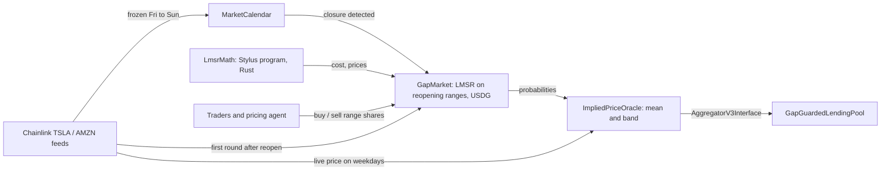

# Gapline

**A market-implied weekend price for tokenized stocks, settled in USDG on Robinhood Chain.**

Tokenized stocks trade onchain 24/7. Their Chainlink feeds do not. From Friday afternoon to Sunday 20:00 ET
the feed holds its last price, and Chainlink's own documentation says it "may hold the last published price"
with "no heartbeats during off-hours". Every lending market, index and vault built on tokenized stocks is
blind for that window, and whoever is on the wrong side of Monday's gap eats it.

Gapline prices that window. For every closure it runs a USDG-collateralized market on where each stock
reopens, turns the market's probabilities into a live price with a confidence band, and exposes it through
the same `AggregatorV3Interface` lending protocols already read. It runs for **TSLA and AMZN**, and the
market maker's pricing math is an **Arbitrum Stylus** program written in Rust.

## The problem, measured

Robinhood's mainnet TSLA feed (`0x4A11...7C38`) over the last three weekends:

| Last print before the weekend | First print after | Frozen for | Reopening gap |
|---|---|---|---|
| $353.98, Fri Sep 4, 18:14 UTC | $354.15, Tue Sep 8, 00:00 UTC (Labor Day) | 77.8 h | +0.05% |
| $365.91, Fri Sep 11, 14:50 UTC | $361.94, Mon Sep 14, 00:00 UTC | 57.2 h | -1.09% |
| $363.80, Fri Sep 18, 19:48 UTC | $365.19, Mon Sep 21, 00:00 UTC | 52.2 h | +0.38% |

The feed is frozen for roughly a third of every week. The first round after every closure lands exactly
at the Sunday 20:00 ET reopen, which is what Gapline settles against. The AMZN feed (`0xD5a1...651C`) behaves
the same way: 13 closures since late June, reopening gaps with an RMS of 0.60% (TSLA: 0.80%).

## How it works



1. **`MarketCalendar`** knows when the 24/5 session is closed: weekends, NYSE holidays and US daylight time.
   A session runs from 20:00 ET on the previous day to 20:00 ET, so shifting Eastern time by four hours maps any
   instant to its trading day.
2. **`GapMarket`** opens during a closure. It snapshots the last pre-close price and splits the reopening
   move into ranges (`-3% or worse`, `-3% to -1%`, ... `+3% or better`). An LMSR market maker, seeded by the
   market's creator with its worst-case loss `b * ln(n)`, always quotes every range, and its prices are
   probabilities. Each winning share redeems for 1 USDG. Every trade pays a 1% fee to the creator, the
   underwriter, so funding a market has positive expected value; fees are kept apart from the collateral that
   backs winning shares. One `GapMarket` serves every stock: a market is bound to the feed it settles on.
   The LMSR math (`exp`, `ln`, cost, prices) runs in **`LmsrMath`, a Stylus program** (see below).
3. **Settlement is permissionless.** Anyone passes the first feed round published at or after the reopen;
   the contract checks the round before it was published earlier, so a later, friendlier round cannot be
   cherry-picked.
4. **`ImpliedPriceOracle`** is a drop-in `AggregatorV3Interface`. When the feed is live it passes the price
   through. When the feed is frozen (closed session, or no update during market hours, which also covers
   corporate-action pauses) it reports `refPrice * (1 + mean move)` from the deepest market for the current
   closure, and a `mean +/- 2 sd` band.
5. **`GapGuardedLendingPool`** (demo) uses the band asymmetrically: new risk (borrow, withdraw) is valued at
   the band's **low** end, liquidation requires the position to be unhealthy at the **high** end. A thin
   weekend DEX print cannot liquidate anyone, and nobody can over-borrow against an optimistic weekend price.
   If the feed is frozen and no market prices it, both pause.
6. **The pool insures itself.** Each weekend the keeper calls `hedge()`: the pool buys shares of the worst
   range paying 10% of its outstanding loans if the stock reopens 3% or more down, spending at most 1% of loans in
   premium. The protocol carrying the gap risk is the buyer that pays the underwriter; `collectHedge()` returns
   any payout to reserves. Borrowers can buy the same cover for their own loans from the Borrow page.

## Pricing in Stylus

`stylus/lmsr-math` is the LMSR math as a Rust program on Arbitrum Stylus, deployed and activated on Robinhood
Chain testnet. Stylus has no floating point, so PRBMath's SD59x18 `exp2` / `log2` (and the 64 binary-fraction
factors behind `exp2`) are ported line for line onto 256-bit integers. `GapMarket` calls it through
`ILmsrMath`; `LmsrMathSol` is the Solidity reference with the same interface.

- **Bit-identical.** `cargo test` checks the port against 1,048 PRBMath vectors (exp, ln and 240 LMSR markets
  of 2, 7 and 16 ranges at depths 10 to 50,000). `scripts/parity_check.py` calls the **deployed** program on all
  240 markets: `cost`, `costDelta` and `prices` are identical to PRBMath on 240 of 240.
- **Gas, measured on the live chain** (`scripts/gas_bench.py`, Stylus vs `LmsrMathSol` deployed alongside):

  | Ranges | `costDelta` (every buy and sell) | `prices` | `cost` |
  |---|---|---|---|
  | 2 | +50% | +86% | +77% |
  | 7 (Gapline's markets) | +6% | +29% | +32% |
  | 16 | **-21%** | **-5%** | +1% |

  Stylus's per-range cost is about 2.2x lower (roughly 4.2K vs 9.1K gas per extra range in `costDelta`),
  but every call pays a fixed 23,337 gas to start the WASM program because **Robinhood Chain has not enabled
  the Stylus cache** (`ArbWasmCache` has no cache managers; the cache bid fails). Cached, the program's init
  cost is 5,141 gas, which would make a 7-range trade roughly 11% cheaper than Solidity instead of 6% dearer
  (an estimate from ArbWasm's `programInitGas`, not a measurement). Finer ranges already win today.

## Deployed on Robinhood Chain testnet (46630)

The Solidity contracts are verified on the explorer. These are the v3 contracts (Stylus pricing, TSLA and AMZN),
deployed 2026-09-23; v1 and v2 are retired.

| Contract | Address |
|---|---|
| LmsrMath (Stylus program) | [`0x4B4909452B47daEaD2303d2072D74C5474E00178`](https://explorer.testnet.chain.robinhood.com/address/0x4B4909452B47daEaD2303d2072D74C5474E00178) |
| GapMarket | [`0xd377e56A0C8DEC0a404D7F06Ad96ccbaA4d1d73b`](https://explorer.testnet.chain.robinhood.com/address/0xd377e56A0C8DEC0a404D7F06Ad96ccbaA4d1d73b) |
| MarketCalendar | [`0xaDE663AE3cDEC75D6918e172d541E0C9F14E3121`](https://explorer.testnet.chain.robinhood.com/address/0xaDE663AE3cDEC75D6918e172d541E0C9F14E3121) |
| TSLA: MirroredFeed (RHTSLA / USD) | [`0xFCABF780284B0d5997914C5b1ab7Ac34F0F01eaE`](https://explorer.testnet.chain.robinhood.com/address/0xFCABF780284B0d5997914C5b1ab7Ac34F0F01eaE) |
| TSLA: ImpliedPriceOracle | [`0x9ee0141d3FD09E4C15D183bD5017ef86e37b4254`](https://explorer.testnet.chain.robinhood.com/address/0x9ee0141d3FD09E4C15D183bD5017ef86e37b4254) |
| TSLA: GapGuardedLendingPool | [`0x17F7f5b6450Cc0E5F4A455d9EA7373Da1E8b0F68`](https://explorer.testnet.chain.robinhood.com/address/0x17F7f5b6450Cc0E5F4A455d9EA7373Da1E8b0F68) |
| AMZN: MirroredFeed (RHAMZN / USD) | [`0x6029842CeC54Be146B28672185f70ca70B8b17df`](https://explorer.testnet.chain.robinhood.com/address/0x6029842CeC54Be146B28672185f70ca70B8b17df) |
| AMZN: ImpliedPriceOracle | [`0x46F6cFBBae33CDe81C137e9de7Ba328d961DDC67`](https://explorer.testnet.chain.robinhood.com/address/0x46F6cFBBae33CDe81C137e9de7Ba328d961DDC67) |
| AMZN: GapGuardedLendingPool | [`0x5f392e8956cBFB2979F8e389dEFC51637D9De483`](https://explorer.testnet.chain.robinhood.com/address/0x5f392e8956cBFB2979F8e389dEFC51637D9De483) |
| LmsrMathSol (gas baseline only) | [`0x8223BBbe2d37e9623faE882888A97C55E2F95BFB`](https://explorer.testnet.chain.robinhood.com/address/0x8223BBbe2d37e9623faE882888A97C55E2F95BFB) |
| USDG (Paxos, testnet) | `0x7E955252E15c84f5768B83c41a71F9eba181802F` |
| TSLA / AMZN stock tokens (testnet) | `0xC9f9c86933092BbbfFF3CCb4b105A4A94bf3Bd4E` / `0x5884aD2f920c162CFBbACc88C9C51AA75eC09E02` |

Chainlink publishes Robinhood stock feeds on mainnet only. On testnet, `MirroredFeed` is an owner-only copy
of the real mainnet RHTSLA / USD or RHAMZN / USD feed: the relayer copies every mainnet round, with its original timestamps,
so the testnet feed freezes and reopens exactly like the real one. On mainnet, point the oracle and markets
at the Chainlink feed directly; nothing else changes.

## Repository

```
contracts/          Foundry: the contracts, LmsrMathSol reference, tests, deploy script, deployments/46630.json
stylus/lmsr-math    Rust Stylus program: LMSR math, PRBMath vectors, on-chain parity check and gas benchmark
packages/abi        typed ABIs and addresses, generated by @wagmi/cli from the Foundry build
apps/relayer        copies each stock's mainnet Chainlink rounds to its testnet MirroredFeed
apps/agent          keeper + pricing agent per stock (opens, prices, settles and collects each weekend)
apps/web            TanStack Router + Query, wagmi, shadcn/ui, zustand; stock picker in the header; live numbers
                    and countdowns refresh in place
ecosystem.config.cjs  pm2 processes for the relayer, agent and web app
docs/DEMO.md        weekend runbook, recording plan, pitch and submission text
docs/knowledge-graph.md   components, addresses, measured facts and decisions (source: knowledge-graph.json)
AGENTS.md / CLAUDE.md     instructions for coding agents working in this repo
```

## Tests

```bash
cd contracts
forge test                                                     # 41 tests, 2 fuzz suites x 1,000 runs
forge test --match-contract ForkedWeekend --fork-url robinhood_testnet   # full weekend on the deployed contracts
STOCK=AMZN forge test --match-contract ForkedWeekend --fork-url robinhood_testnet
cd ../stylus/lmsr-math && cargo test --lib                      # Stylus port vs 1,048 PRBMath vectors
python3 scripts/parity_check.py                                 # the deployed program vs the same vectors
```

- `MarketCalendar`: summer and winter closures, Thanksgiving, the DST-change weekend, and a fuzz test that
  every closed instant has a later open that really is the first open instant.
- `GapMarket`: pricing, slippage, round trips losing only fees, all-in quotes, fees to the creator, cherry-pick
  resistance, settlement, and a fuzz test that the market stays solvent and fully accounted for (collateral plus
  fees) after any sequence of trades and any settlement price.
- `ImpliedPriceOracle` + `GapGuardedLendingPool`: passthrough, frozen-without-market pause, stale feed during
  market hours, bearish weekend shrinking borrowing power, a fake weekend print failing to liquidate, a
  consensus crash that does liquidate, deepest-market source selection, and the pool's hedge: bought within
  budget, once per market, paying out in a crash and expiring worthless on a calm weekend.
- `scripts/rehearse-weekend.sh`: the whole weekend on a local fork with the **real agent and web app**, for both
  stocks at once: the keeper opens both markets, points both oracles, has both pools hedge and trades on
  Saturday, then settles, collects the pools' cover, withdraws the residuals and claims fees after the Sunday
  reopen. Local forks cannot execute Stylus WASM, so the fork runs the bit-identical `LmsrMathSol` at the
  Stylus address (the fork test does the same).
- `ForkedWeekend`: forks the live testnet and plays out borrow, freeze, pause, market open, the pool's hedge,
  gap-down trading, a -4% reopen, settlement, the hedge paying into the pool, the underwriter's fees and return
  to the live feed, all against the deployed v3 addresses; `STOCK=AMZN` runs it for the second stock.

## The agent

`apps/agent` runs every minute, for every stock:

- **Keeper.** When the session closes it opens each stock's weekend market (depth 10, seeded with
  `b * ln(7)` = 19.46 USDG), points each oracle at its deepest market and has each pool buy its cover. After the reopen it waits for the first
  post-reopen feed round, settles, collects the pool's cover, redeems winning shares, withdraws the maker's
  residual and claims the underwriter fees.
- **Pricing agent.** Forecasts the reopening move and trades the market toward that forecast:
  - **Uniswap TSLA/USDG and AMZN/USDG** on Robinhood Chain mainnet (the $660K and $869K v3 pools), because
    the stock tokens keep trading while the stocks do not. Depth-filtered: ignored below $100K of liquidity or more than 10% away
    from Friday's close, which is what keeps a thin pool's fake print out;
  - **the weekend BTC move** from Robinhood mainnet's Chainlink WBTC / USD feed, times a beta fitted per stock
    (TSLA 0.35, AMZN 0.20);
  - the forecast blends the two, with weights from each stock's backtest below: 50/50 for TSLA, 70% DEX for
    AMZN, whose deeper pool alone was the best single forecast;
  - optional Claude analyst: when `ANTHROPIC_API_KEY` is set, Claude Opus 5 searches the weekend's news about
    the company and returns a bounded drift with a confidence, which is added to the mean;
  - the belief is a normal distribution over the reopening move (sd 0.75% for TSLA, 0.55% for AMZN); for the
    range with the largest disagreement it can act on (a buy, or a sell of shares it holds), it trades the
    LMSR shares that close part of the gap, `delta = b * ln(t(1-p) / (p(1-t)))`;
  - hard limits: 3 USDG per trade, 10 USDG net per market, no short positions, simulate before sending.

### Backtest

`npm run backtest -w @gapline/agent -- <TSLA|AMZN>` replays every weekend closure in the stock's mainnet
Chainlink feed history (13 since late June 2026) and reads the Uniswap pool's price from its swap logs. Full
tables in [`docs/backtest-TSLA.md`](docs/backtest-TSLA.md) and [`docs/backtest-AMZN.md`](docs/backtest-AMZN.md).
Mean absolute error on the 9 weekends per stock with pool data (RMS error in brackets):

| Forecast of the reopening gap | TSLA | AMZN |
|---|---|---|
| No change (what a frozen feed assumes) | 0.67 pp (0.79) | 0.60 pp (0.69) |
| BTC move x beta (0.35 / 0.20) | 0.51 pp (0.59) | 0.55 pp (0.60) |
| Uniswap pool, 1 h before reopen | 0.45 pp (0.54) | 0.28 pp (0.36) |
| **Blend (the agent's forecast; 0.5 / 0.7 DEX)** | **0.39 pp (0.51)** | **0.30 pp (0.34)** |

The pools called the direction right on 6 of 7 (TSLA) and 6 of 8 (AMZN) weekends with a gap of at least
0.25%. Actual gaps had an RMS of 0.80% (TSLA) and 0.60% (AMZN), so the market's ranges are sized to match:
`-3% or worse`, `-3% to -1%`, `-1% to -0.25%`, `-0.25% to +0.25%`, and the mirror images. Thirteen weekends is
a small sample; the parameters are configurable and the tables regenerate as weekends accumulate.

## Running it

```bash
npm install
cp .env.example .env                  # PRIVATE_KEY of a funded Robinhood testnet wallet
npm run abi                           # regenerate typed ABIs after contract changes
npx pm2 start ecosystem.config.cjs    # relayer, agent, and the web app on http://localhost:4173
npx pm2 logs                          # watch them
```

To share the web app from another machine (for example a server), run only it there and put it behind Tailscale;
the relayer and agent stay on the one machine already running them, since both sign with the deployer key:

```bash
npx pm2 start ecosystem.config.cjs --only web
tailscale funnel --bg --https=443 http://localhost:4173   # public; `tailscale serve` keeps it tailnet-only
```

Deploying fresh contracts: `cd contracts && forge script script/Deploy.s.sol --rpc-url robinhood_testnet
--private-key $PRIVATE_KEY --broadcast --verify --verifier blockscout
--verifier-url https://explorer.testnet.chain.robinhood.com/api/`, then `npm run abi`.

## Assumptions and limits

- **Market depth is the security budget.** Moving the implied price costs real USDG against the LMSR, and the
  oracle only trusts markets above a minimum depth and always the deepest one. On testnet the depth is small
  (faucet-sized); a production deployment would size `b` to the value borrowed against the stock.
- **Holidays are set by the calendar's owner.** Full-day NYSE closures through 2027 are preloaded from
  nyse.com; early closes are not modelled.
- **Settlement window.** A market must settle on a round published within 6 hours of the reopen. On every
  weekend checked, the first round landed at the reopen itself.
- **The lending pool is a demo.** No interest, no lender accounting; it exists to show how a real market
  would consume the band.
- **Testnet feed.** Prices are real mainnet Chainlink prices relayed by an owner key, which is a trust
  assumption that disappears on mainnet.
- **Testnet budget.** One faucet claim (100 USDG) funds both stocks: two depth-10 markets (38.9 USDG of seed,
  mostly returned after settlement), 10 USDG in each lending pool and the agent's 10 USDG cap per market.
- **Stylus cache.** Until Robinhood Chain enables the Stylus cache, every call to the pricing program pays a
  23K-gas init cost, so 7-range trades cost about 6% more gas than the Solidity reference (see above).
