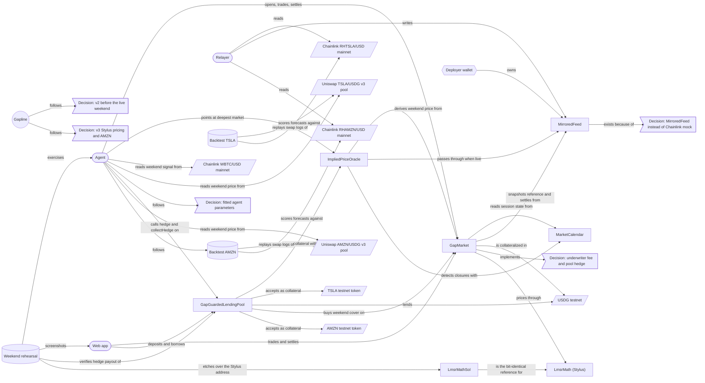

# Knowledge graph

Generated from `knowledge-graph.json` by `npm run kg` (last updated 2026-09-24). Edit the JSON, not this file.

## Projects

### Gapline

- Prices the weekend gap in tokenized stocks (TSLA and AMZN) on Robinhood Chain with a USDG-settled LMSR market
- Built for Arbitrum Open House Singapore online buildathon; submissions close 2026-10-04
- Targets the Robinhood Chain reserved prize and the Paxos USDG bonus; pricing math runs on Arbitrum Stylus
- Live weekend demo: Fri 2026-09-25 20:00 ET close to Sun 2026-09-27 20:00 ET reopen
- v3 deployed 2026-09-23 (Stylus pricing, TSLA + AMZN); v1 and v2 retired

## Contracts

### MarketCalendar

- Testnet address 0xaDE663AE3cDEC75D6918e172d541E0C9F14E3121 (v3), verified; shared by all stocks; v2 0x4897cA16aF49F84D689b59Be81abD9C0C760280f retired
- Trading day D runs 20:00 ET on D-1 to 20:00 ET on D; open when D is a weekday and not a holiday
- Handles US daylight time; owner sets NYSE full-day holidays (preloaded through 2027)
- No nextClose view: the web app reads the next 8 sessionStart boundaries and takes the first closed one
- 7 tests including a 1,000-run fuzz over 2026-2030

### MirroredFeed

- One per stock (v3): TSLA 0xFCABF780284B0d5997914C5b1ab7Ac34F0F01eaE (RHTSLA / USD), AMZN 0x6029842CeC54Be146B28672185f70ca70B8b17df (RHAMZN / USD), verified
- v2 TSLA mirror 0x284a56BFBa8D03b662A23f4788bD458f835058f5 retired
- Owner-only AggregatorV3Interface; owner is the relayer key
- Exists because Chainlink publishes Robinhood stock feeds on mainnet only

### GapMarket

- Testnet address 0xd377e56A0C8DEC0a404D7F06Ad96ccbaA4d1d73b (v3), verified; serves every stock, a market is bound to its feed
- v2 0x5f2d5F54e28002a9b06100532a1EE9B9ad5e479e and v1 0x44540A78c4006897109b33A60d89E4a5522CC4dB retired
- LMSR over reopening ranges; creator seeds b * ln(n) USDG; winning share redeems 1 USDG
- v3: all LMSR math (cost, costDelta, prices) goes through ILmsrMath, the immutable math address set at construction
- Outcome shares are ERC1155Supply tokens, tokenId = marketId << 8 | outcome
- resolve(marketId, roundId) needs the first round at or after reopen, within 6 h, predecessor before reopen
- feeBps = 100 on every buy and sell to the creator (underwriter), claimable anytime via claimFees; quotes all-in
- 17 tests including a 1,000-run solvency fuzz with fees

### ImpliedPriceOracle

- One per stock (v3): TSLA 0x9ee0141d3FD09E4C15D183bD5017ef86e37b4254, AMZN 0x46F6cFBBae33CDe81C137e9de7Ba328d961DDC67, verified; v2 0xeB246817d2440F82F4B4C04c2C120afEFe1E5EC4 retired
- Drop-in AggregatorV3Interface: live feed when fresh, market-implied mean and +/-2 sd band when frozen
- Frozen = session closed or feed older than 1 day during market hours
- setActiveMarket is permissionless but only the deepest market for the current closure, min depth 10 shares

### GapGuardedLendingPool

- One per stock (v3): TSLA 0x17F7f5b6450Cc0E5F4A455d9EA7373Da1E8b0F68, AMZN 0x5f392e8956cBFB2979F8e389dEFC51637D9De483, verified, demo only; each funded with 10 testnet USDG
- v2 0xBB924f325a7cDb1D53E514cB9691E3a19e26F6d1 retired; its 20 USDG recovered by borrowing against 1 TSLA
- Borrow and withdraw priced at band low; liquidation requires unhealthy at band high
- Pauses both when the feed is frozen and no market prices it
- hedge(marketId) buys worst-range cover paying 10% of totalDebt for at most 1% of it, once per market; collectHedge redeems
- Max LTV 50%, liquidation threshold 70%, bonus 5%

### LmsrMath (Stylus)

- stylus/lmsr-math, Rust on Arbitrum Stylus; testnet 0x4B4909452B47daEaD2303d2072D74C5474E00178, activated 2026-09-23 (fee ~0.0001 ETH), 19.5 KB
- cost, costDelta, prices over SD59x18; PRBMath exp2/log2 ported line for line to alloy I256 (no floats in Stylus)
- Bit-identical to PRBMath: 1,048 vectors in cargo test --lib, and 240/240 markets called on the deployed program (parity_check.py)
- Gas vs LmsrMathSol on testnet: costDelta +50% at 2 ranges, +6% at 7, -21% at 16; per extra range ~4.2K vs ~9.1K gas
- Robinhood Chain has no Stylus cache managers: each call pays 23,337 gas init (5,141 if cached); cache bid fails
- Not source-verified on the explorer; forks cannot run it, so tests etch LmsrMathSol at its address

### LmsrMathSol

- Solidity reference implementation of ILmsrMath on PRBMath; generates the test vectors (script/LmsrVectors.s.sol)
- Used by unit tests, fork tests and the rehearsal; deployed once on testnet at 0x8223BBbe2d37e9623faE882888A97C55E2F95BFB as the gas baseline, verified

## Services

### Relayer

- apps/relayer, runs under pm2, logs/relayer.log
- Every 15 s, for each stock in turn, mirrors every missed mainnet round in order with original timestamps (one account, so stocks go sequentially)

### Agent

- apps/agent, runs under pm2, logs/agent.log, ticks every 60 s, loops over every stock
- Keeper: opens each stock's closure market (depth 10, seed 19.46 USDG, ranges -300/-100/-25/25/100/300 bps), points each oracle, has each pool hedge, settles, collects cover, redeems, withdraws residual, claims fees
- Pricing agent: normal belief per stock, mean = w x Uniswap gap + (1 - w) x (beta x weekend BTC move) plus optional Claude drift; TSLA w 0.5 beta 0.35 sd 0.75%, AMZN w 0.7 beta 0.20 sd 0.55%
- Trades the largest disagreement it can act on (buy, or sell of held shares)
- Uniswap signal ignored below $100K pool liquidity or beyond 10% from Friday's close
- Hard caps: 3 USDG per trade, 10 USDG net per market, never short, simulate before send
- Claude analyst is off until ANTHROPIC_API_KEY is set; it searches news about the market's company
- Follows chain time (syncClock each tick), since contracts judge sessions by block.timestamp

### Web app

- apps/web, TanStack Router + Query, wagmi 3 injected connector, shadcn radix-nova, zustand
- Served by pm2 at http://localhost:4173 (vite preview of the production build); shared over Tailscale Serve/Funnel by proxying http://localhost:4173, with preview.allowedHosts admitting *.ts.net
- Header stock picker (TSLA / AMZN, persisted in zustand); every hook reads the selected stock's feed, oracle, pool and token
- Landing page at /: headline, an illustrated weekend chart (Friday price, frozen Chainlink line, Gapline's widening range, the reopen inside it), a live strip with both stocks' price, state and range, how a weekend runs, what lenders get
- Market page at /app: ranges, trade panel, cost to move the implied price 1% (client-side LMSR), underwriter fees; an empty state with a countdown to Friday's market
- Borrow page at /app/borrow: gap-aware pricing banner, Protect my loan (cover sized to 10/25/50% of debt), the pool's own cover
- Footer links GapMarket, the LmsrMath Stylus program and the selected stock's oracle and pool
- Checked with Playwright screenshots on 2026-09-22 in weekday, Saturday (fork) and settled Monday (fork) states
- Live numbers refresh in place: reads taking 'now' key on a shared 15 s clock (lib/clock.ts), refetches keep the last result scoped per stock, countdown and 'feed updated ... ago' re-render only themselves once a second. Playwright on 2026-09-24, 40 s on the market page: 0 skeleton swaps (7 before the fix), the time readouts updated 40 times (9 before)
- Wallet stays connected across reloads (wagmi localStorage + reconnectOnMount), shows Reconnecting meanwhile, lists EIP-6963 wallets; checked 2026-09-24 with Playwright and a mock injected wallet on /app and /app/borrow
- Visual identity since 2026-09-24: navy and amber theme, IBM Plex Sans and Mono; designed with the frontend-design skill and copy edited with the humanizer skill

## Externals

### Chainlink RHTSLA/USD mainnet

- 0x4A1166a659A55625345e9515b32adECea5547C38 on Robinhood Chain mainnet (4663), 8 decimals, us_equities_24/5
- Holds last price off-hours with no heartbeats
- First round after each closure lands exactly at Sunday 20:00 ET
- Frozen 52.2-77.8 h on the weekends of Sep 4, 11 and 18 2026; gaps +0.05%, -1.09%, +0.38%

### Chainlink WBTC/USD mainnet

- 0x62107b0d3adA75fc1697fD342d99eed947a3aA5E on Robinhood Chain mainnet; the agent's weekend signal

### USDG testnet

- Paxos Global Dollar 0x7E955252E15c84f5768B83c41a71F9eba181802F on Robinhood testnet, 6 decimals

### TSLA testnet token

- 0xC9f9c86933092BbbfFF3CCb4b105A4A94bf3Bd4E, 18 decimals, dispensed by the Robinhood testnet faucet
- Used as collateral by the TSLA lending pool

### Uniswap TSLA/USDG v3 pool

- 0xf4ACdAEEB7022862A763C9B1B885e11191c889E3 on Robinhood Chain mainnet, 0.3% fee, ~$660K liquidity on 2026-09-23
- token0 TSLA stock token 0x322F0929c4625eD5bAd873c95208D54E1c003b2d, token1 USDG 0x5fc5360D0400a0Fd4f2af552ADD042D716F1d168
- Trades through the weekend; historical prices come from Swap events because the public RPC has no archive state

### Chainlink RHAMZN/USD mainnet

- 0xD5a1508ceD74c084eBf3cBe853e2C968fB2a651C on Robinhood Chain mainnet, 8 decimals, same 24/5 schedule as TSLA
- 13 closures since late June 2026; reopening gap RMS 0.60%

### Uniswap AMZN/USDG v3 pool

- 0x8AC92DA74AB5F3b1d024Dc1943Ad7e15Dc4179Ef on Robinhood Chain mainnet, 0.3% fee, ~$869K on 2026-09-23
- token0 AMZN stock token 0x12f190a9F9d7D37a250758b26824B97CE941bF54 (18 dec), token1 USDG; same orientation as TSLA

### AMZN testnet token

- 0x5884aD2f920c162CFBbACc88C9C51AA75eC09E02, 18 decimals, dispensed by the Robinhood testnet faucet; collateral in the AMZN pool

## Accounts

### Deployer wallet

- 0x610FdB41DA83138615C317c89fd9EB09271a46fe, burner, key in git-ignored .env and considered exposed
- Relayer owner, market creator and agent trader on testnet; deployed the Stylus program
- 2026-09-23 after v3 setup: 80 USDG, 3 TSLA, 5 AMZN, ~0.009 ETH; 1 TSLA each sits as collateral in the retired v1 and v2 pools

## Decisions

### Decision: v2 before the live weekend

- 2026-09-23: ship underwriter fee, pool auto-hedge, protection UI, cost-to-move display and DEX signal before Fri 2026-09-25
- Reason: Sep 25-28 is the only full live weekend before the Oct 4 deadline and its recording is the demo

### Decision: MirroredFeed instead of Chainlink mock

- MockV3Aggregator lets anyone write prices; on a public testnet that would let strangers settle markets

### Decision: fitted agent parameters

- 2026-09-23: beta 0.3 -> 0.35 (least squares), sd 2% -> 0.75%, 50/50 DEX+BTC blend, ranges tightened from +-0.5/2/5% to +-0.25/1/3%
- Reason: backtest showed gaps far smaller than assumed and the blend beat each signal alone

### Decision: underwriter fee and pool hedge

- 2026-09-23: v1 had no fee, so nobody would rationally underwrite; the pool was not a buyer of cover
- v2 adds a 1% trading fee to the market's creator and makes the lending pool buy its own weekend cover
- Answers the judge question 'who else trades this?': the protocol carrying the gap risk pays the underwriter

### Decision: v3 Stylus pricing and AMZN

- 2026-09-23: move LMSR math into a Stylus program and add AMZN as a second stock before the live weekend
- Stylus: targets the Arbitrum buildathon theme; kept despite +6% gas at 7 ranges because the cost is the chain's missing cache, finer ranges already win, and parity is proven on-chain
- AMZN: second-deepest faucet stock with a deep Uniswap pool; fitted separately because its gaps and BTC beta differ from TSLA
- Budget: depth 10 per stock so one faucet claim (100 USDG) covers two seeds, two pools and the agent caps

## Evidences

### Backtest TSLA

- docs/backtest-TSLA.md, generated by npm run backtest -w @gapline/agent -- TSLA
- 13 weekend closures since late June 2026, 9 with Uniswap swap data
- MAE: no change 0.67 pp, BTC x 0.35 0.51 pp, DEX 0.45 pp, 50/50 blend 0.39 pp; DEX direction right 6 of 7
- Actual reopening gap RMS 0.80%; least-squares BTC beta 0.34

### Weekend rehearsal

- scripts/rehearse-weekend.sh: anvil fork of testnet, real agent, clock moved to the coming weekend
- Saturday: market opened, oracle pointed, pool bought cover (0.50 USDG payout for 0.07 USDG), trader bought 10.35 shares of -1% to -0.25%
- Sunday: settled on the reopening round, pool collected 0.50 USDG, residual withdrawn, 0.019 USDG fees claimed
- Surfaced six bugs fixed before the live weekend: agent wall-clock time, ambiguous range prices, UTC freeze label, stale oracle badge, settled-card label, session-close countdown
- 2026-09-23 rerun on v3 for both stocks (TSLA -3.5%, AMZN +0.8%), with LmsrMathSol etched over the Stylus address: both markets opened, both pools hedged, TSLA pool collected 0.25 USDG cover, residuals and fees collected

### Backtest AMZN

- docs/backtest-AMZN.md, generated by npm run backtest -w @gapline/agent -- AMZN
- MAE: no change 0.60 pp, BTC x 0.20 0.55 pp, DEX 0.28 pp, 0.7 DEX blend 0.30 pp (RMS 0.34, lowest); DEX direction 6 of 8
- Least-squares BTC beta 0.20; gap RMS 0.60%
