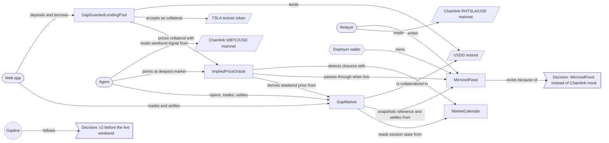

# Knowledge graph

Generated from `knowledge-graph.json` by `npm run kg` (last updated 2026-09-23). Edit the JSON, not this file.

## Projects

### Gapline

- Prices the weekend gap in tokenized stocks on Robinhood Chain with a USDG-settled LMSR market
- Built for Arbitrum Open House Singapore online buildathon; submissions close 2026-10-04
- Targets the Robinhood Chain reserved prize and the Paxos USDG bonus
- Live weekend demo: Fri 2026-09-25 20:00 ET close to Sun 2026-09-27 20:00 ET reopen

## Contracts

### MarketCalendar

- Testnet address 0x951F2e74FA66Bec48d8Bd5481C6B95D8147f75ba, verified
- Trading day D runs 20:00 ET on D-1 to 20:00 ET on D; open when D is a weekday and not a holiday
- Handles US daylight time; owner sets NYSE full-day holidays (preloaded through 2027)
- 7 tests including a 1,000-run fuzz over 2026-2030

### MirroredFeed

- Testnet address 0xBfB0559AF20D15E844FF17810570c028Bad764C7, verified, description RHTSLA / USD (mainnet mirror)
- Owner-only AggregatorV3Interface; owner is the relayer key
- Exists because Chainlink publishes Robinhood stock feeds on mainnet only

### GapMarket

- Testnet address 0x44540A78c4006897109b33A60d89E4a5522CC4dB (v1), verified
- LMSR over reopening ranges; creator seeds b * ln(n) USDG; winning share redeems 1 USDG
- Outcome shares are ERC1155Supply tokens, tokenId = marketId << 8 | outcome
- resolve(marketId, roundId) needs the first round at or after reopen, within 6 h, predecessor before reopen
- v1 has no trading fee, so underwriters have no expected profit (v2 adds a fee)
- 13 tests including a 1,000-run solvency fuzz

### ImpliedPriceOracle

- Testnet address 0xA7E0E23f9dab3041a0bd506db09f3d22a73d2406 (v1), verified
- Drop-in AggregatorV3Interface: live feed when fresh, market-implied mean and +/-2 sd band when frozen
- Frozen = session closed or feed older than 1 day during market hours
- setActiveMarket is permissionless but only the deepest market for the current closure, min depth 10 shares

### GapGuardedLendingPool

- Testnet address 0x6BF25eC4CB7E909b181cc844b4642a84c2f9A850 (v1), verified, demo only
- Borrow and withdraw priced at band low; liquidation requires unhealthy at band high
- Pauses both when the feed is frozen and no market prices it
- Max LTV 50%, liquidation threshold 70%, bonus 5%; funded with 20 testnet USDG

## Services

### Relayer

- apps/relayer, runs under pm2, logs/relayer.log
- Polls mainnet RHTSLA/USD every 15 s and mirrors every missed round in order with original timestamps

### Agent

- apps/agent, runs under pm2, logs/agent.log, ticks every 60 s
- Keeper: opens the closure market (depth 20), points the oracle, settles, redeems, withdraws residual
- Pricing agent: normal belief with mean = 0.3 x weekend BTC move (+ optional Claude drift), sd 2%
- Hard caps: 5 USDG per trade, 25 USDG net per market, never short, simulate before send
- Claude analyst is off until ANTHROPIC_API_KEY is set

### Web app

- apps/web, TanStack Router + Query, wagmi 3 injected connector, shadcn radix-nova, zustand
- Served by pm2 at http://localhost:4173 (vite preview of the production build)
- Not yet checked visually in a browser

## Externals

### Chainlink RHTSLA/USD mainnet

- 0x4A1166a659A55625345e9515b32adECea5547C38 on Robinhood Chain mainnet (4663), 8 decimals, us_equities_24/5
- Holds last price off-hours with no heartbeats
- First round after each closure lands exactly at Sunday 20:00 ET
- Frozen 52.2-77.8 h on the weekends of Sep 4, 11 and 18 2026; gaps +0.05%, -1.09%, +0.38%

### Chainlink WBTC/USD mainnet

- 0x62107b0d3adA75fc1697fD342d99eed947a3aA5E on Robinhood Chain mainnet; the agent's weekend signal

### USDG testnet

- Paxos Global Dollar 0x7E955252E15c84f5768B83c41a71F9eba181802F on Robinhood testnet, 6 decimals

### TSLA testnet token

- 0xC9f9c86933092BbbfFF3CCb4b105A4A94bf3Bd4E, 18 decimals, dispensed by the Robinhood testnet faucet

## Accounts

### Deployer wallet

- 0x610FdB41DA83138615C317c89fd9EB09271a46fe, burner, key in git-ignored .env and considered exposed
- Relayer owner, market creator and agent trader on testnet

## Decisions

### Decision: v2 before the live weekend

- 2026-09-23: ship underwriter fee, pool auto-hedge, protection UI, cost-to-move display and DEX signal before Fri 2026-09-25
- Reason: Sep 25-28 is the only full live weekend before the Oct 4 deadline and its recording is the demo

### Decision: MirroredFeed instead of Chainlink mock

- MockV3Aggregator lets anyone write prices; on a public testnet that would let strangers settle markets
